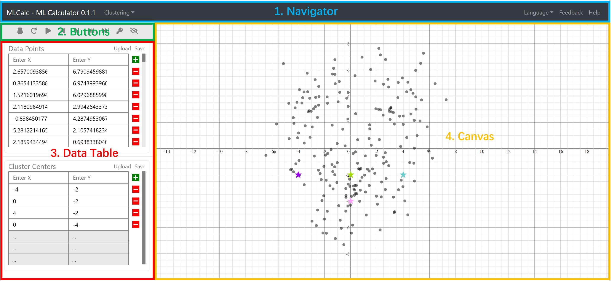
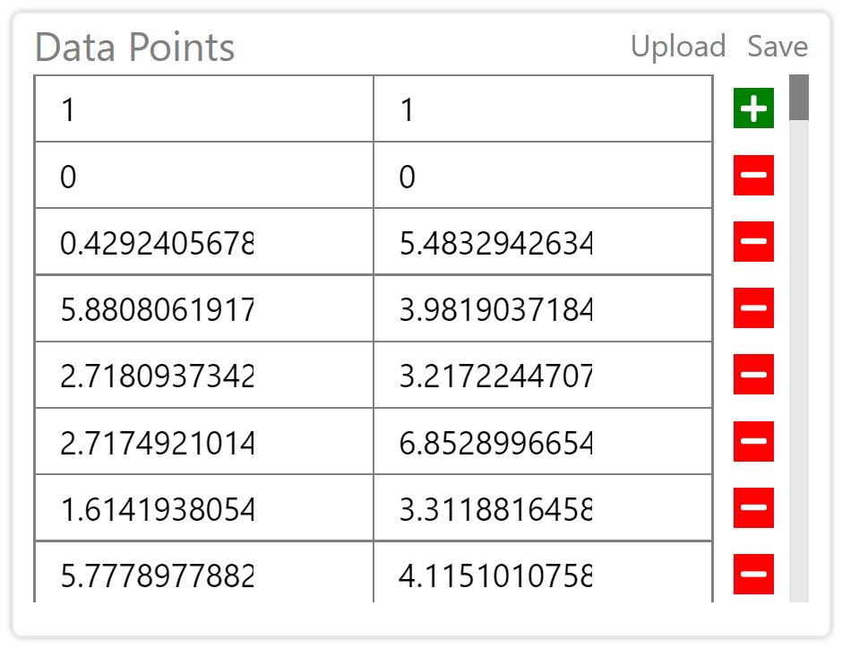
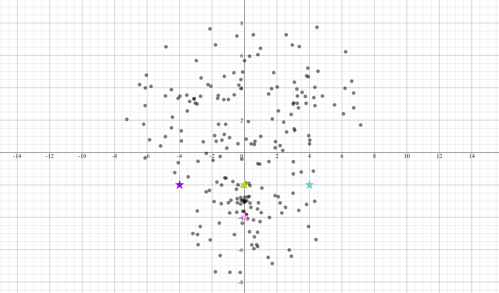

---
# Title, summary, and page position.
linktitle: 网页应用：数据科学计算器
summary: 
weight: 2
icon: book-reader
icon_pack: fas

# Page metadata.
title: 网页应用：数据科学计算器
date: "2021-08-10T00:07:24Z"
type: book  # Do not modify.
---
## Demo of the Project
A demo of the project is deployed here: https://mlcalc.azurewebsites.net/

## Purpose
Design and create a interactive calculator that runs with machine learning algorithms

## Usages
1. Help beginners in data science learn common machine learning algorithms, e.g. K Means, Logistic Regression, faster and better. 
2. Offer a useful tool that deals with small to medium datasets (less than 10000 data points). 

## Challenges

### UI design:
The very first question I asked myself starting the project was how I should design the user interface to make it not only ready to use but also easy to use?\

With this question, I spent the frst several days designing the user interface. In the end, I had three designs. I compared them against each other and finally chose this one with four components. 

I will walk you through the details of each component.
#### Navigation Bar
A navigation bar sticks to the top of the interface allowing users to select an algorithm, switch between languages, provide feedback, and access help information.
#### Buttons

Just like most electronic calculators, this calculator also has buttons. Here are the descriptions for each button.

1 "Process Data": compute the result with the data points and the cluster centers\
2 "Show Initial Condition": display the data points unclustered and the cluster centers in their original positions\
3 "Autoplay": start a self-running presentation of the intermediate steps in the algorithm\
4 "Show Previous Step": display the previous step of the algorithm\
5 "Show Next Step": display the next step of the algorithm\
6 "Show Previous Iteration": display the previous iteration of the algorithm\
7 "Show Next Iteration": display the next iteration of the algorithm\
8 "Show Final Result": display the final result\
9 "Toggle On/Off Boundaries": toggle on or toggle off the clustering boundaries\
#### Data Table
Below the buttons bar is two data tables. The upper table contains the data points and the lower table contains the cluster centers. I figured out the following specifications for this component.
1. It is *editable*: Users should feel smooth to perform add, delete, upload, download, save, and edit functions. 
2. It is *self-aware*: When users enter an invalid value, e.g., '001' or '0.1.0', it should resist accepting the false data.
3. It is *smooth*: Suppose a user wants to edit the values on the 5th row while the cursor is on the 1st row. The component should allow him to accomplish this task without any friction.

#### Canvas
The canvas is the most powerful component and the gist of the product. It contains an interactive coordinate system with data points and clustering centers plotted. The coordinate system has the following specifications.
1. It is *borderless*: No matter how large quantities are used for a data point/cluster center (x, y), it is going to appear on the plane.
2. It is *interactive*: The plane should be pannable and zoomable with the grid size and data point locations adjusted accordingly.
3. It is *spontaneous*: Whenever the user modifies the data table, the change should be immediately reflected on the plane.

### Technical
When I was done designing the product, I immediately faced difficulty carrying out the plan. To implement data table was already quite a problem to me who did even know how to use React. To carry out the canvas design could be even more frustrating. However, I was able to get both of them with two months' hard work.

#### Implementing the Data Table
#### Implementing the Canvas
#### Numerical Analysis Involved

<!-- １.	难点：
a.	希望坐标系是一个理论上没有上限和下限的坐标系，以方便用户使用任何数量级的数据，
b.	不管坐标系如何移动或缩放，数据点始终在正确的位置
c.	还有坐标系的尺度应该是随着缩放而变化的
解决：使用了HTML的svg，在svg里面画网格线、坐标轴线和数据点
		      写了一些复杂的JavaScript函数（比如zoom，pan等等）和很多的状态量（比如原点坐标、网格尺度、网格大小等等）
２.	难点：
a.	希望数据表是一个允许用户自由、流畅地添加数据的工具，需要数据表支持键盘按键，通过上下左右键来支持光标移动，
b.	自动检测输入的合法性，只能允许输入浮点数，如果输入字母会报错
解决：使用了HTML的table
３.	需要快速的算法来保证计算效率，JavaScript没有特别好的机器学习库
解决：比如线性回归要用最小二乘法，第一种求逆矩阵，但是效率很低，其他方法有QR分解法，cholesky分解和LU分解法，我把每一种实现一遍然后比较一下性能的差异 -->

## Issues:
1. Since all the heavy computation work is done by the client-side device, the product can only deal with small datasets. To scale up the project, we should set up a cloud server on platforms like AWS, Microsoft Azure, etc. and move all the computing functions there.
2. Due to lack of manpower, the calculator only supports the K Means algorithm. Although I have invested 3-month work to make it a powerful prototype, the project is far from complete. We can definitely support more algorithms in future.