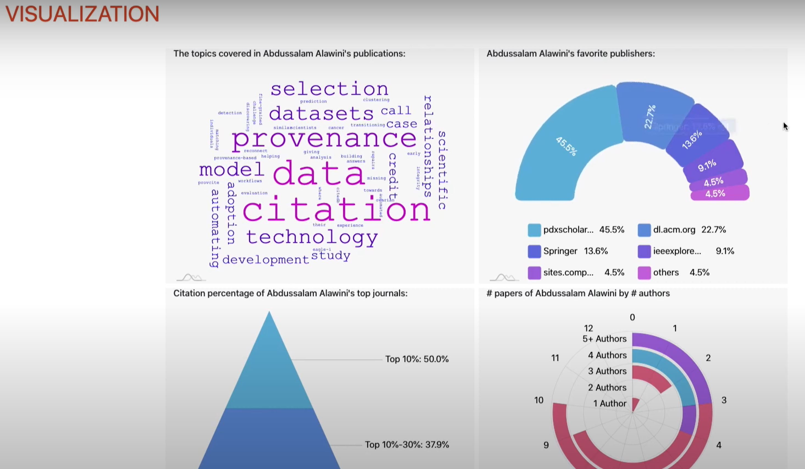
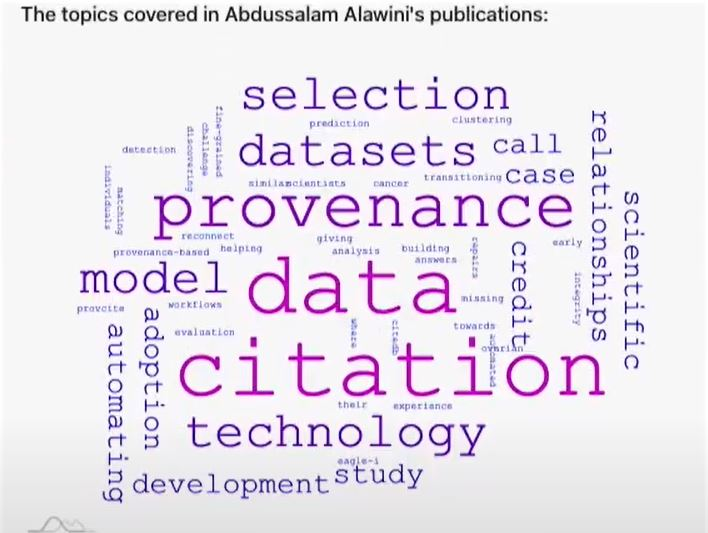
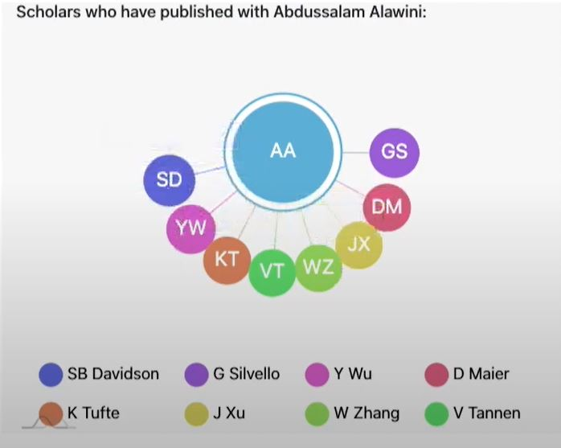
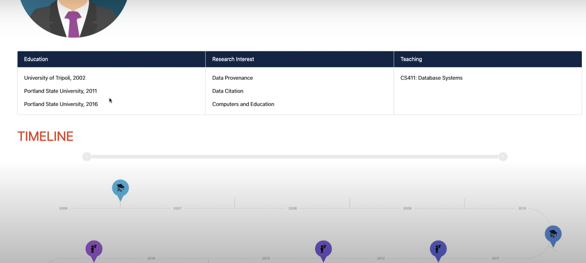
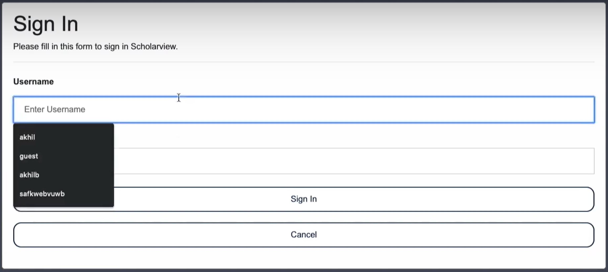

---
# Title, summary, and page position.
linktitle: Google Scholar Visualization System (Web App)
summary: 
weight: 1
icon: book-reader
icon_pack: fas

# Page metadata.
title: Google Scholar Visualization System (Web App)
date: "2021-08-10T00:07:26Z"
type: book  # Do not modify.
---

## Overview of the Project
This project is a group project for CS411 in Spring 2020. I led a team of four students to create a web app with both frontend UIs and backend service. Please find the video demo of the project here: https://www.youtube.com/watch?v=qVbehPwiN7Y

## Purpose
Build a product that helps people understand a scholar's research history and academic impact through data visualization.

## What I learned
1. I learned web development fundamentals: JavaScript Language, HTML, CSS, and how to use data visualization libraries, e.g., D3.js and amCharts.
2. I learned backend development by creating backend service, connecting my server to databases, and deploying the project to AWS.
3. I learned object-oriented design by creating a user management system from scratch.

## Challenges
### 1. Product Design Challenges
#### 怎么样设计数据可视化系统才能让用户更好地了解一个教授的学术历史？用什么数据？如何处理数据？用什么图表
a. 比如为了展示教授的研究方向，我们把教授发表的paper的标题用网络爬虫爬取出来，然后分解成一个个的单词，去掉无意义的单词比如冠词，代词，连词等等，剩下的单词按照出现频率来用word cloud来展示\

b. 再比如为了展示教授在学术圈内的关系，我们统计了教授的每个合作作者的共享引用次数，然后用力导引图展示了共享引用次数前十名的合作作者

### 2. Technical Challenges
主要有三个技术方面的难题:
#### 爬取数据
难点：谷歌学者上面的数据要用网络爬虫来爬取，转化成合适的格式才能保存在数据库里面\
解决：
1. 用Python Scrapy写了一个小型程序来爬取数据，然后把数据保存成JSON
2. 谷歌学者对单位时间内的访问次数有限制，这个不太好解决，只能多出点人力

#### 用户管理系统
难点：从零开始写了一个用户管理系统，它的逻辑比较复杂\
解决： 
1. 登出：登出时登录状态改成已登出，提示用户成功登出
2. 登录：登陆时和数据库查验是否已注册，提示用户成功登入
3. 注册：注册时和数据库查验是否已注册，如果已注册那提示用户，如果没有写入数据库然后提示用户用户名已存在或者成功注册

#### 快速计算
难点：后端对数据进行计算，要求高效率的算法，不然会网页加载卡顿的问题\
解决：一个例子是建立词云的时候，需要用到“最常见的K个单词”算法
